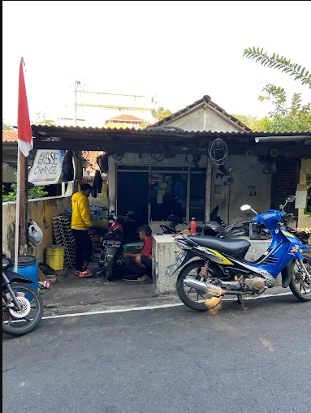
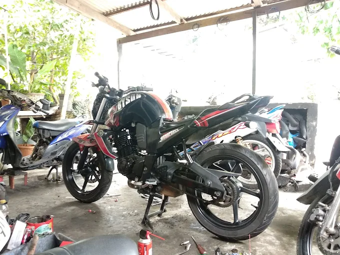

# 🏍️ Bengkel Motor Mas Djalal — Landing Page

## 🚀 Live Demo
🌐 [lp-bengkel-mas-djalal.vercel.app](https://lp-bengkel-mas-djalal.vercel.app/)

## 📌 About The Project

Landing page modern untuk **Bengkel Motor Mas Djalal** (Semarang) yang dibuat untuk meningkatkan kehadiran online dan memberikan informasi bisnis yang jelas bagi calon pelanggan.

Website ini fokus pada:

- Desain responsif (mobile-first)
- Performa cepat
- UI/UX modern
- Call-to-action yang jelas (booking servis via WhatsApp)

## ✨ Features

- Layout responsif untuk mobile & desktop
- Desain landing page modern
- Section layanan (servis ringan, ganti oli, tune-up, dll)
- Section kontak / CTA booking
- Performa teroptimasi
- Struktur kode yang bersih dan scalable

## 🛠️ Built With

- [Next.js 14](https://nextjs.org/) (App Router)
- [React 18](https://react.dev/)
- [TypeScript](https://www.typescriptlang.org/)
- [Tailwind CSS](https://tailwindcss.com/)
- [shadcn/ui](https://ui.shadcn.com/) + [Radix UI](https://www.radix-ui.com/)
- [Vercel](https://vercel.com/) (hosting & deployment)

## 📂 Project Structure

```
├── app/
│   ├── layout.tsx      # Root layout + metadata SEO
│   ├── page.tsx        # Halaman utama
│   └── globals.css
├── components/
│   ├── ui/              # Komponen shadcn/ui (button, card, dialog, dll)
│   └── theme-provider.tsx
├── hooks/                # Custom hooks (use-mobile, use-toast)
├── lib/                  # Utility functions
├── public/
│   └── images/           # Aset gambar (servis, workshop, dll)
└── styles/
```

## ⚙️ Installation & Setup

1. Clone repository:
   ```bash
   git clone https://github.com/bicaradigital/LP-Bengkel-Mas-Djalal.git
   ```
2. Masuk ke folder project:
   ```bash
   cd LP-Bengkel-Mas-Djalal
   ```
3. Install dependencies:
   ```bash
   npm install
   ```
4. Jalankan development server:
   ```bash
   npm run dev
   ```
5. Buka di browser:
   ```
   http://localhost:3000
   ```

## 🚀 Deployment

Project ini di-deploy menggunakan **Vercel**.

Untuk deploy versi kamu sendiri:

1. Push project ke GitHub
2. Import repository ke [Vercel](https://vercel.com/new)
3. Deploy — Vercel otomatis mendeteksi Next.js dan menjalankan `npm run build`

> **Catatan:** pastikan `package.json` sudah mencantumkan seluruh dependency yang dipakai komponen di `components/ui/` (Radix UI, react-hook-form, recharts, dll), jika tidak build akan gagal dengan error `Module not found`.

## 🎯 Goals

Tujuan utama project ini adalah membangun kehadiran digital yang profesional untuk bisnis otomotif lokal, dengan performa yang tetap ringan dan navigasi yang ramah pengguna.

## 📸 Preview

| Eksterior Bengkel | Workshop |
|---|---|
|  |  |

## 📬 Contact

Untuk kolaborasi atau pertanyaan seputar project:

- GitHub: [github.com/bicaradigital](https://github.com/bicaradigital)

## 📄 License

Project ini open-source dan tersedia untuk keperluan belajar serta portfolio.
